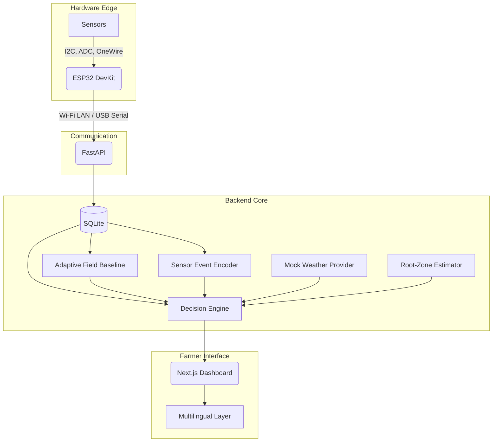

# KhetAI — Smart Farming Platform

KhetAI is a local, AI-powered agricultural monitoring system designed for Indian farmers. It combines real-time physical sensor data (via ESP32) with a deterministic decision engine to provide actionable, multilingual irrigation and field-management recommendations.

This repository represents the complete end-to-end pipeline through Phase 1 to Phase 6.

## System Architecture

The architecture is entirely **local-only**. No cloud deployment or external AI processing is used, ensuring privacy, reliability in low-connectivity environments, and deterministic decision explanations.



## Supported Hardware (Phase 6 Final Integration)

The project requires exactly five physical measurements. Do **not** connect unsupported sensors (like pH or EC) to this pipeline.

| Measurement | Sensor Module | Interface | Default Pin |
|-------------|---------------|-----------|-------------|
| **Soil Moisture** | Capacitive Moisture Sensor v1.2 | ADC | GPIO 34 |
| **Soil Temperature** | DS18B20 (Waterproof) | OneWire | GPIO 4 |
| **Light Intensity** | BH1750 | I2C | SDA/SCL |
| **Air Humidity** | SHT31 | I2C (0x44) | SDA/SCL |
| **Surrounding Temp** | SHT31 | I2C (0x44) | SDA/SCL |

*Note: A single sensor failure will not crash the ESP32. The valid readings will still be transmitted.*

## Setup Instructions

### 1. ESP32 Firmware

The firmware is built with PlatformIO and supports both USB/Serial debugging and Wi-Fi LAN transmission.

1. **Configure local credentials:**
   Create or edit `esp32/include/config.h`. This file is gitignored and must never be committed.
   ```cpp
   #define DEVICE_ID "FIELD_001"
   #define WIFI_SSID "YOUR_WIFI_SSID"
   #define WIFI_PASSWORD "YOUR_WIFI_PASSWORD"
   #define BACKEND_URL "http://192.168.1.100:8000/api/sensors/readings"
   #define COMMUNICATION_MODE "WIFI" // or "SERIAL"
   ```
   *Important: Use your laptop's actual LAN IP for `BACKEND_URL`. Do not use `localhost` on the ESP32.*

2. **Compile and flash:**
   Install PlatformIO and run:
   ```bash
   cd esp32
   pio run -t upload
   ```

### 2. Backend (FastAPI + SQLite)

1. Create a Python virtual environment and install dependencies:
   ```bash
   cd backend
   python -m venv venv
   # Windows: venv\Scripts\activate
   # Mac/Linux: source venv/bin/activate
   pip install -r requirements.txt
   ```
2. Start the server (runs on `localhost:8000`):
   ```bash
   uvicorn main:app --reload
   ```
   *The SQLite database (`sensors.db`) is automatically created.*

### 3. Frontend Dashboard (Next.js)

1. Install dependencies:
   ```bash
   npm install
   ```
2. Start the development server (runs on `localhost:3000`):
   ```bash
   npm run dev
   ```

---

## End-to-End Workflow & Demonstration

To demonstrate the full pipeline:

1. **Initialize the Context:**
   Open `http://localhost:3000`, click **Login**, and configure the Farmer Profile (State, District, Crop, Sowing Date). Click **Save Profile**.
2. **Hardware Connection:**
   Power the ESP32. The dashboard will detect the connection and display live sensor values.
3. **Adaptive Baseline:**
   The backend will establish an initial regional baseline based on the crop and growth stage, and then begin adapting to the actual field readings.
4. **Triggering Events:**
   Alter the physical sensors (e.g., remove the moisture sensor from soil to simulate drying). The dashboard will register a `NEW` event, progressing to `PERSISTENT` over time.
5. **Decision & Multilingual output:**
   The Decision Engine fuses the persistent event, estimated root-zone moisture, and weather mock data into a confidence-scored recommendation.
   Use the language dropdown to instantly translate the explanation into Hindi, Tamil, Telugu, or Kannada.

### Simulator (Optional)
If physical hardware is unavailable, run the deterministic demo script to simulate real field data across three scenarios:
```bash
cd backend
python demo.py
```

---

## Technical Features

- **Phase 1:** Cinematic Farm Landing Page
- **Phase 2:** Farmer Profile & India Agro-Climate Context
- **Phase 3:** ESP32 C++ Sensor Integration & FastAPI API
- **Phase 4:** Adaptive Field Baseline & Finite-State Event Encoding
- **Phase 5:** Evidence-Fusion Decision Engine & Root-Zone Estimator
- **Phase 6:** Deterministic Multilingual Presentation & Live Dashboard Status
